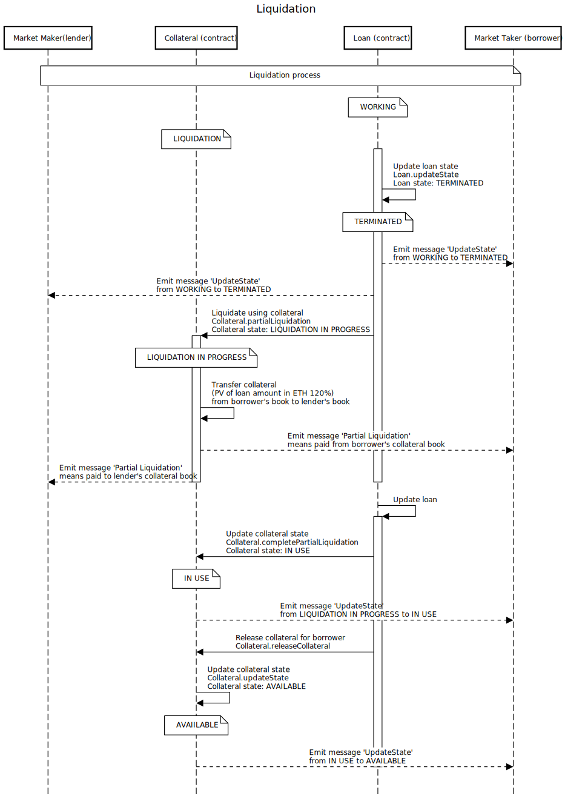

# 🌿 Basics of Secured Finance

Secured Finance is an institutional-grade financial transaction platform with automatic collateral management and mark-to-market mechanisms. We designed a protocol from accumulated knowledge from [40-years](https://en.wikipedia.org/wiki/Swap_(finance)#History) of the financial industry that governs [558 trilions of dollars of OTC (i.e. peer-to-peer) derivative transactions](https://stats.bis.org/statx/srs/table/d5.1) and made the interbank market system open to the public. With this protocol, we built scalable, flexible, decentralized peer-to-peer markets for loans and FX, and then we will add swaps and options as we progress.

This directory has diagrams to explain how each player, network, and smart contracts interact with each other. The interaction is designed using FSM (Finite State Machine); therefore, it heavily depends on the states of loans and contracts. This document aims to help understand how those states change along with the lifecycle of a loan transaction.

## Players

- Market Maker
  - Users using the Secured Finance web app, and propose their borrow/lend interest rates, bid/offer FX rates) to market takers.
- Market.sol
  - A smart contract to gather all market information. It works like a database.
- Collateral.sol
  - A smart contract that collets ETH as collateral and manages the control of the funds' ownership based on its state (`EMPTY`, `AVAILABLE`, `IN_USE`, `MARGIN_CALL`, `PARTIAL_LIQUIDATION`, `LIQUIDATION`). For FIL as collateral, we keep txHash and let the user's counterparty confirm the FIL balance manually.
- Loan.sol
  - It is a smart contract that stores all the loans to manage schedules for coupon payments, calculate PV (present value), and control its state (`REGISTERED`, `WORKING`, `DUE`, `PAST_DUE`, `CLOSED`, `TERMINATED`).
- Scheduler
  - It stays on the user's browser (or our back-up server in case nobody is using the web app) and uses web3js pub-sub to catch a new blockhead as a clock-tick. Each tick kicks batch operations such as market updates, re-evaluate PV of all financial products for a margin call.
- Filecoin Network
  - The Filecoin network to send/receive and verify the balance of FIL custody accounts.
- Market Taker
  - Users who see the market maker's proposal and take a deal. In a loan deal, they will be borrowers or lenders. To make a lending deal to borrow money, they have to collateralize ETH (or FIL) to the Collateral smart contract.

## The Lifecycle of Loans

A loan takes one of the following 6 steps, depending on the states of Collateral and Loan contracts. Detailed sequence diagrams are shown in the next section.

### ✍️ 1. Registration, Collateralization, and Market Making

   1. Market Makers(makers) register themselves with their ETH and FIL addresses to receive funds. They also register an ID such as DID to anchor a government-issued identity and public keys so that a counterparty can choose who they want to trade to comply with AML and other financial regulations.
   2. To quote as borrowers, makers should collateralize their ETH or FIL to custody address. In the ETH case, it is the address of Collateral contract.
   3. Before input quotes to the Market smart contract, makers help verify other maker's FIL balance. They pick random FIL address from Collateral contracts and update the balance. It is a mechanism to keep all FIL account balances up to date. In this regard, we are developing a P2P oracle to make it more efficient.

### 🤝 2. Loan Execution

   1. Market Takers(takers) pick the best loan rate for lending/borrowing. If takers want to borrow funds, their collateral amount must be greater than 150% of the borrowing amount.
   2. When a maker receives an event message that their FIL lending proposal was taken, they should transfer FIL and input txHash to the Loan Contract.
   3. When a taker receives an event message for the arrival of borrowing FIL, they should verify the amount from the Filecoin network and confirm to start the loan.
   4. The loan state changes from `REGISTERED` to `WORKING`, and the collateral state changes from `AVAILABLE` to `IN_USE`.

### 💫 3. Coupon Payments

   1. Periodically, the Loan contract checks the payment schedule and update the loan's state.
   2. Before the scheduled payments, the Loan contract emits messages for payment advice (default to 2 weeks prior). After the advice, the loan state changes to `DUE`, and the coupon payments should be made until the payment time.
   3. If takers failed to pay coupons, the loan state changes to `PAST_DUE` and the collateral state changes to `PARTIAL LIQUIDATION` to cover up coupon payments from takers' collateral.
   4. Suppose the collateral currency is different from loan currency. In that case, one of the best makers is nominated as the liquidity provider, and they will convert partial ETH collateral to FIL with a very attractive rate (default to 120%).
   5. In any case, coupon payment will be made, and the loan state will be back to `WORKING` and the collateral state to be `IN_USE`.

### ✅ 4. Redemption

   1. Redemption works similarly to the coupon payments. However, the final states of the Loan and Collateral are different. If a loan ends with no liquidation, the loan state will be `CLOSED`, and the collateral state ends with `AVAILABLE`. Otherwise, a loan ends with liquidation, the loan state will be `TERMINATED`, and the collateral state will be `EMPTY`.

### 🆘 5. Margin Call

   1. Periodically, the Loan contract updates PV (present value) of all loans and checks the collateral coverage. If a borrowed loan PV goes up and therefore the collateral coverage gets below 150%, the collateral state will change from `MARGINCALL`.
   2. If takers upsize collateral and the coverage gets over 150%, the state will be back to `IN_USE`.
   3. However, if takers don't respond, and the coverage gets below 125%, we consider this a credit event; therefore, the collateral state will be shifted further to `LIQUIDATION`. Then the automatic liquidation process will begin. It works as a credit support annex in traditional financial transactions. Market makers should acknowledge this automatic liquidation feature.

### 🔄 6. Liquidation

   1. When the Collateral contract emits a message for automatic liquidation, the best maker is nominated to be the liquidity provider, who is entitled to convert currency (FIL to ETH) back to the loan currency with a very attractive rate (receive 120% coverage collateral).
   2. The rest of the collateral (about 5%) will be reserved to support makers and developers.
   3. After liquidations, the loan state will be `TERMINATED`, and the collateral state will be `EMPTY`.

## Sequence Diagram

Each step with the state changes are displayed followed by its sequence diagram.

### (1) States for Registration, Collateralization, and Market Making ✍️

```txt
Loan registration done
Loan state: REGISTERD
Collateral state: EMPTY or AVAILABLE
```


### (2) Loan Execution States 🤝

```txt
Initial collateral needed and covered
Loan state: REGISTERD -> WORKING
Collateral state: AVAILABLE -> IN_USE
```


### (3) Coupon Payments States 💫

```txt
Coupon payment is due
Loan state: WORKING -> DUE
Collateral state: IN_USE
```

```txt
Coupon due -> paid
Loan state: DUE -> WORKING
Collateral state: IN_USE
```

```txt
Coupon due -> unpaid
Loan state: DUE
Collateral state: IN_USE -> PARTIAL_LIQUIDATION

Coupon unpaid -> paid
Loan state: DUE -> WORKING
Collateral state: PARTIAL_LIQUIDATION -> IN_USE
```


### (4) Redemption States ✅

```txt
Redemption due
Loan state: WORKING -> DUE
Collateral state: IN_USE
```

```txt
Redemption due -> paid
Loan state: DUE -> CLOSED
Collateral state: AVAILABLE
```

```txt
Redemption due -> unpaid
Loan state: DUE
Collateral state: IN_USE -> LIQUIDATION

Redemption unpaid -> paid
Loan state: DUE -> TERMINATED
Collateral state: LIQUIDATION -> EMPTY
```


### (5) Margin Call States 🆘

```txt
Margin call (125% < coverage < 150%)
Loan state: WORKING
Collateral state: IN_USE -> MARGINCALL
```

```txt
Margin call covered
Loan state: WORKING
Collateral state: MARGINCALL -> IN_USE
```

```txt
Margin call failed (coverage < 125%)
Loan state: WORKING
Collateral state: MARGINCALL -> LIQUIDATION
```


### (6) Liquidation States 🔄

```txt
Liquidation
Loan state: WORKING -> TERMINATED
Collateral state: LIQUIDATION -> EMPTY
```


