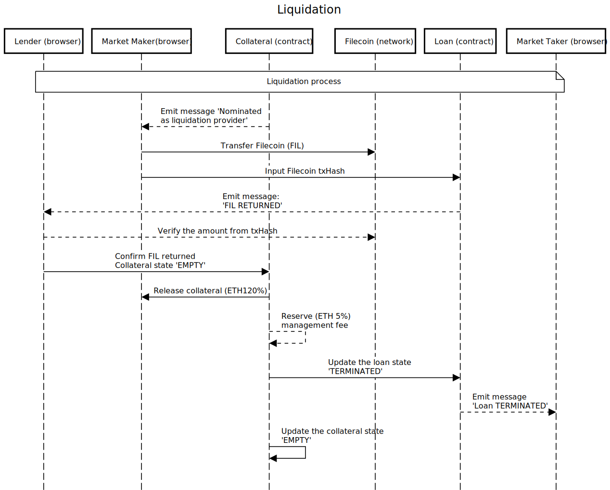

# Sequence Diagram
This directory has diagrams to explain how each players, components, smart contracts interact each other.

## Players
- Market Maker
  - Users using the Secured Finance web app, and show their borrow/lend interest rates, bid/offer FX rates)
- Market.sol
  - A smart contract to gather all market information. It works like a database.
- Collateral.sol
  - A smart contract that collets ETH as collateral and manages the control of the funds ownership based on its state (EMPTY, AVAILABLE, IN_USE, MARGINCALL, LIQUIDATION). For FIL as collateral, we keep txHash and let user's counterparty to manually confirm the FIL balance.
- Loan.sol
  - A smart contract that stores all the loans to manage schedules for coupon payments and calculate PV (present value), and control its state (REGISTERED, BEGIN, CLOSED, TERMINATED).
- Scheduler
  - It stayes on user's browser (or our back-up server in case nobody is using the web app) and uses web3js pub-sub to catch a new block head and uses as a clock-tick to kick batch operations such as market updates, re-evaluate PV of all financial products for margin call.
- Filecoin
  - The Filecoin network to send/receive and verify balance.

## (1) Registration to Market Making

## (2) Loan Execution

## (3) Margin Call

## (4) Liquidation

## (5) Coupon Payments and Redemption
